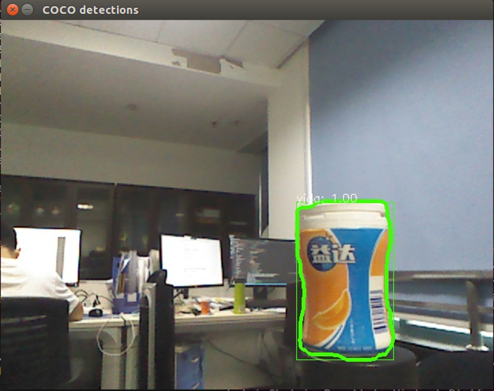

参考：https://wiki.nps.edu/display/RC/Kinect+Installation+on+Ubuntu+14.04+and+ROS+Indigo

将Kinect摄像头接入ubuntu14.4，ROS indigo和Mask RCNN的图像识别服务，便于在不启动Baxter时利用Kinect的摄像头检测图像识别模型的目标识别效果，只需将原代码的订阅节点从Baxter末端摄像头切换到Kinect即可。

<!-- more -->

# 一、部署环境

ubuntu安装OpenNI驱动和primeSense sensor module：

```bash
# openni
sudo apt-get install libopenni0 libopenni-dev
```

```bash
# primeSense
git clone https://github.com/avin2/SensorKinect
cd Bin
tar xjf SensorKinect093-Bin-Linux-x64-v5.1.2.1.tar.bz2
cd Sensor-Bin-Linux-x64-v5.1.2.1
sudo ./install.sh
```

# 二、使用openni_launch包发布topic

假设catkin工作空间为~/ros_ws，

```bash
cd ~/ros_ws/src
git clone https://github.com/ros-drivers/openni_camera
git clone https://github.com/ros-drivers/rgbd_launch.git
# 复制openni_camera文件夹的openni_camera，openni_description，openni_launch到src目录
cd ..
catkin_make
catkin_make install
```

# 三、在ROS环境中查看Kinect图像

连接Kinect到USB，打开ROS环境并运行open.launch，即在本地roscore可接收Kinect发布的图像：

```bash
# Terminal 1
source /opt/ros/indigo/setup.bash
roscore
# Terminal 2
source /opt/ros/indigo/setup.bash
roslaunch openni_launch openni.launch
# Terminal 3
# 运行需要使用摄像头的程序
source /opt/ros/indigo/setup.bash
rosrun rviz rviz
```

这样就可以在`/camera/rgb/image_color` topic上接收到RGB图片，也可以在rviz看到其他节点的深度图像。

