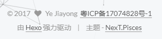

根据国家规定，通过域名备案的网站需要在网站底部展示网站的备案号，但是Hexo并没有配置备案号的选项，如果你使用NexT主题的话，可以通过修改主题配置文件来实现这个效果。

<!--more -->

## 操作步骤

打开`Hexo根目录\themes\next\layout\_partials`，找到`footer.swig`文件，打开后在紧接着`<span class="author"....</span>`这一行后加上这行：

```html
<span>&nbsp;<a href="http://www.miitbeian.gov.cn/">粤ICP备xxxxxxxx号</a></span>
```

位置如下：

```html
  <span class="author" itemprop="copyrightHolder">{{ config.author }}</span>
  <span>&nbsp;<a href="http://www.miitbeian.gov.cn/">粤ICP备xxxxxxxx号</a></span>
</div>
```

将上面的备案号更改为自己网站的备案号即可。

添加完毕的效果如下：

