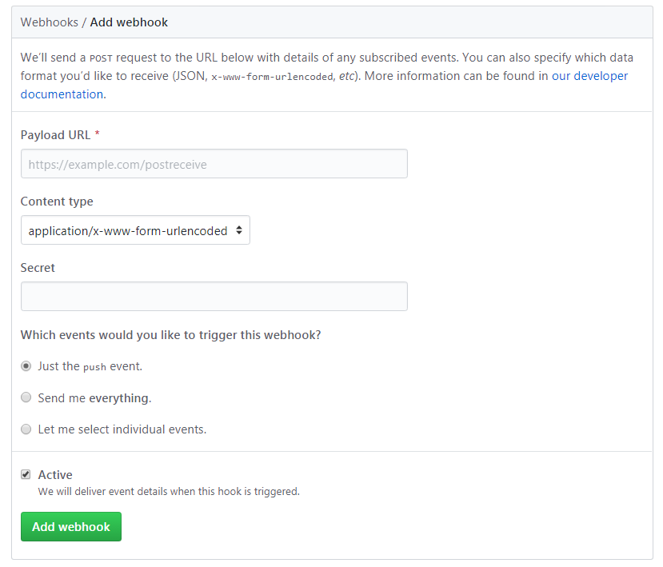
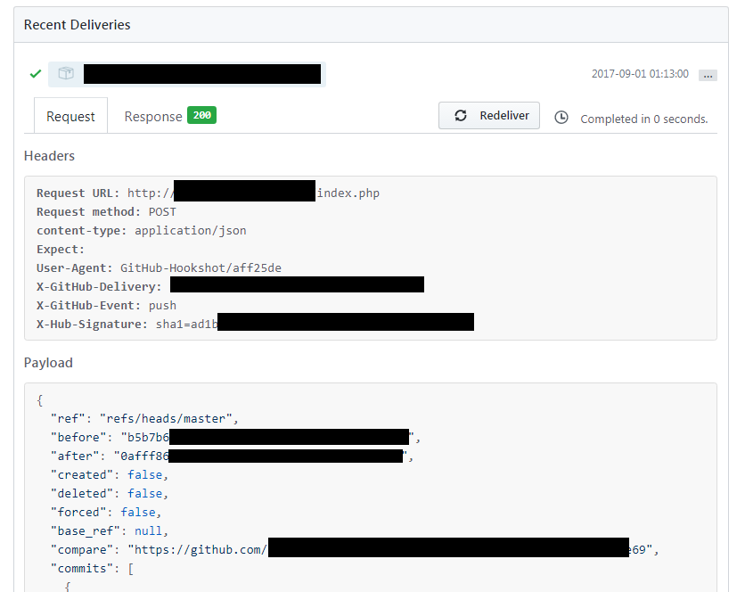

## 前言

Webhooks可谓是GitHub的其中一个大杀器，利用Webhooks可以做很多自动化执行的事情。

在正确配置了Webhooks的项目上，Webhooks会接受对当前项目指定的操作（如commit、push、pull request等）作为触发响应的事件，当事件被触发后，Webhooks会向绑定的域名发送一条带有操作信息的web请求。若一个服务器监听了这个web请求的地址和端口，那么该服务器就可以接收该请求并获取操作信息，同时根据信息执行不同的任务。

一个典型的场景就是远程服务器自动部署Web项目。向项目提交修改后，通过Webhooks向服务器发送请求，服务器接收并分析Webhooks请求后执行脚本，自动部署当前项目到Web目录，即可立即在浏览器查看当前作出的修改。下面就以这个场景为例配置Webhooks和服务器，来实现上述效果。

服务器执行环境：Ubuntu 14.04，Apache 2.4.7，PHP 5.5.9

GitHub Webhooks 文档：https://developer.github.com/webhooks/

<!-- more -->

## 配置Webhooks

打开Github项目仓库页面-Settings-Webhooks，进入Webhooks配置页面，点击Add Webhooks新增一个webhook，如图：



配置项如下：

Payload URL：webhook发送请求的URL地址。

Content type：webhook请求数据格式。

Secret：可选，用于服务器对webhook请求进行校验。若该项被设置后，服务器的校验方法如下：
1. 在请求的`X-Hub-Signature`头带有服务器的校验算法和签名，格式为`算法=签名`，例如`sha1=xxxxxxxxxxxxxxx`；
2. 服务器利用该算法进行HMAC校验，其中key为配置的Secret值，value为webhook发送的消息体；
3. 若计算的签名与`X-Hub-Signature`头附带的签名一致则通过，否则为错误请求。

在“Which events would you like to trigger this webhook?”中选择webhook响应的事件种类，可选择仅响应push事件、响应所有事件及自定义要响应的事件。

若勾选了Active选项，则事件详情会包含在webhook请求的消息体中。

配置完毕后，点击Add webhook会为当前项目新增一条webhook。与此同时，webhook会向当前URL发送一条ping请求，用于测试域名是否可用。在Recent Deliveries中可以查看webhook发送的请求，当请求发送成功会显示绿色的打钩图标，发送错误显示红色的交叉图标。

一个典型的请求如下：



## 配置服务器

在配置完Webhooks后，还要对接收webhook请求的服务器进行配置，才能正确响应webhook发送的请求。在此处本人使用PHP接收webhook请求，并调用一个服务器脚本，来自动更新部署在`/var/www/html/`目录内的git项目。

为方便监测服务器是否正确处理webhook的请求，此处还利用了[Server酱自动发送信息的功能](http://sc.ftqq.com)，发送方法位于`sc_send()`，如果不需要的话可以删去。

文件如下：

```php
<?php

    error_reporting(1);

    $secret = ''; // 在webhook配置的secret字符串
    $sc_key = ''; // Server酱用户key
    $shell_path = ''; // shell脚本所在位置

    // Server酱发送信息的程序
    function sc_send($text, $desp = '', $key = $sc_key)
    {
        $postdata = http_build_query(
            array(
                'text' => $text,
                'desp' => $desp
            )
        );
        $opts = array('http' =>
            array(
                'method'  => 'POST',
                'header'  => 'Content-type: application/x-www-form-urlencoded',
                'content' => $postdata
            )
        );
        $context = stream_context_create($opts);
        return $result = file_get_contents('https://sc.ftqq.com/'.$key.'.send', false, $context);
    }

    // 获取webhook信息
    $payload = file_get_contents('php://input');
    $json = json_decode($payload, true);
    $headers = apache_request_headers(); // 该函数只在Apache生效

    if ($secret !== '') {
        if (!array_key_exists('X-Hub-Signature', $headers)) {
            // 服务器签名获取失败
            sc_send("错误：webhook secret在github未配置或者获取签名失败");
            exit("错误：webhook secret在github未配置或者获取签名失败");
        } else {
            $secret_header = $headers['X-Hub-Signature'];
            list($algo, $hash_from_server) = explode('=', $secret_header, 2);
            $hash_result = hash_hmac($algo, $payload, $secret);
            if ($hash_result !== $hash_from_server){
                $text = "github发送的签名：" . $hash_from_server . "</br>服务器校验结果：" . $hash_result;
                sc_send("错误：webhook secret校验错误</br>" . $text);
                exit("错误：webhook secret校验错误</br>" . $text);
            }
        }
    }

    // 校验通过，执行脚本
    $repo = $json['repository']['name'];
    exec($shell_path . ' ' .$repo);

```

当PHP程序正确获取webhook请求并校验成功后，在最后一句`exec()`会调用服务器的脚本进行进一步的操作。

在调用服务器脚本时需要注意Apache默认执行的用户为www-data，有可能出现权限不足的现象。

一个典型的自动拉取git仓库的脚本如下：

```sh
#!/bin/sh
# 从传入参数$1中获取仓库名称，构造git仓库路径
deployTargetDir="/var/www/html/${1}"

git --git-dir=${deployTargetDir}/.git --work-tree=${deployTargetDir} reset --hard origin/master
git --git-dir=${deployTargetDir}/.git --work-tree=${deployTargetDir} clean -f
git --git-dir=${deployTargetDir}/.git --work-tree=${deployTargetDir} pull
git --git-dir=${deployTargetDir}/.git --work-tree=${deployTargetDir} checkout master
```

通过`[脚本名] [git仓库名]`命令调用脚本。

至此，简单的webhook使用配置完成，若需要执行更复杂的功能，例如根据webhook不同事件的请求响应不同操作，可以在PHP文件和脚本中加入更多的判断和指令。